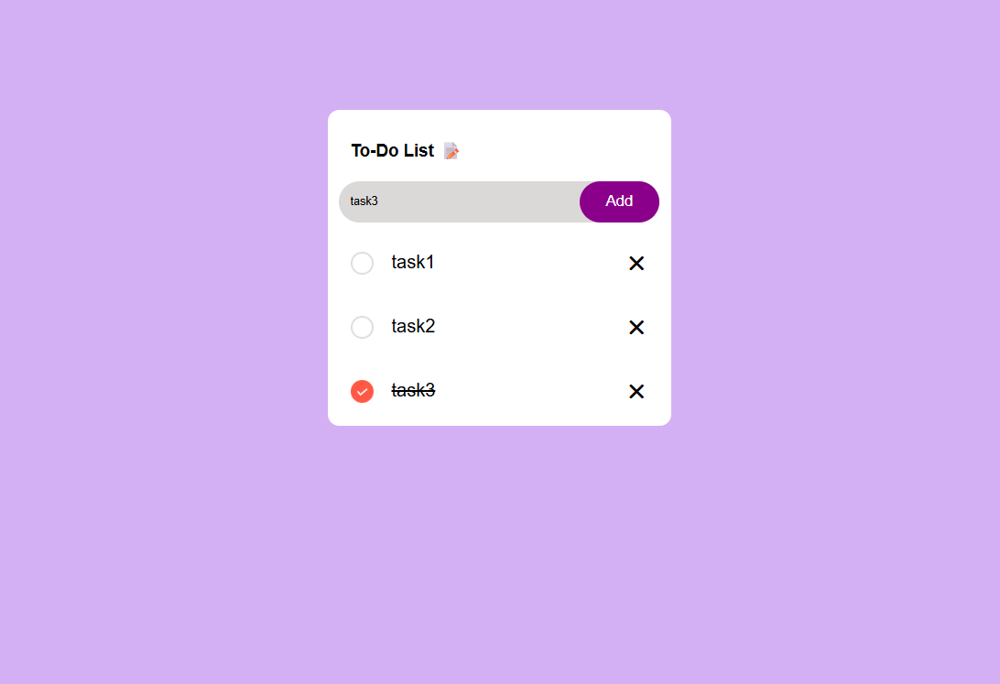

# 📝 Todo App

A simple and responsive Todo List application built using **HTML, CSS, and JavaScript**. Manage your daily tasks efficiently by adding, completing, and deleting tasks with an intuitive interface.

---

## 🚀 Live Demo

🔗 https://jscday02.netlify.app/

---

## 📸 Preview

<p align="center">
  
</p>

---

## ✨ Features

- ➕ Add new tasks
- ✅ Mark tasks as completed
- ❌ Delete tasks
- 🎨 Clean and modern user interface
- 📱 Responsive design
- ⚡ Fast and lightweight

---

## 🛠️ Tech Stack

- HTML5
- CSS3
- JavaScript (ES6)

---

## 📂 Project Structure

```text
todo-app/
│── src/
│── checked.png
│── unchecked.png
│── index.html
└── README.md
```

---

## ⚙️ Getting Started

### Clone the repository

```bash
git clone https://github.com/asiya2123/todo-app.git
```

### Navigate to the project folder

```bash
cd todo-app
```

### Open the project

Simply open **index.html** in your preferred browser.

---

## 📖 How It Works

- Enter a task in the input field.
- Click the **Add** button to add it to the list.
- Click the circle icon to mark a task as completed.
- Click the **×** icon to remove a task.

---

## 🎯 Future Improvements

- 💾 Save tasks using Local Storage
- ✏️ Edit existing tasks
- 📅 Add due dates
- 🔍 Search tasks
- 🗂️ Filter (All / Active / Completed)
- 🌙 Dark Mode

---

## 📬 Connect With Me

**👩‍💻 Asiya Shaik**

- 🏗️ GitHub: https://github.com/asiya2123
- 💼 LinkedIn: https://www.linkedin.com/in/shaik-asiya786

---

## ⭐ Support

If you enjoyed this project,

⭐ Star this repository

🍴 Fork this repository

💡 Share your feedback

---

<p align="center">
Made with ❤️ by <strong>Asiya Shaik</strong>
</p>
